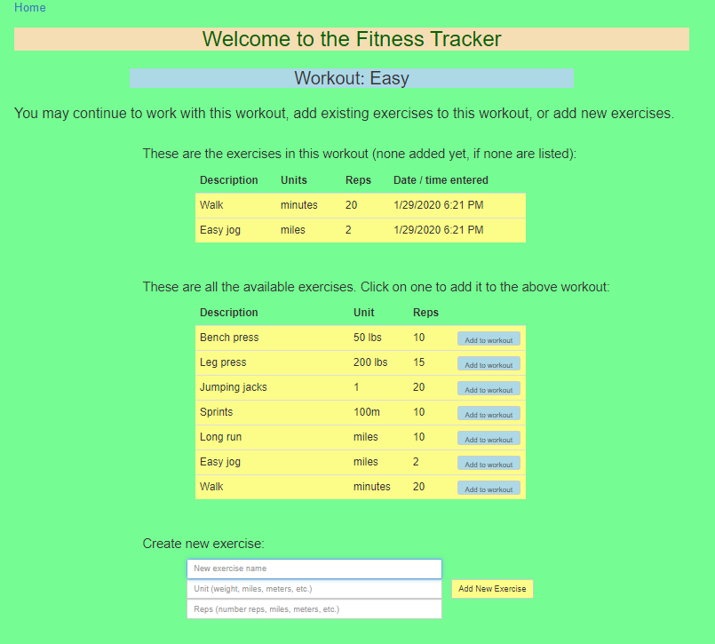

# Fitness Tracker
Fitness tracker using mongoDB and Mongoose

[Link to Github repository.](https://github.com/MauraSlavin/fitness "Github repository")

[Link to deployed app.](https://gentle-sierra-23761.herokuapp.com/workout.html "Deployed app")

## User story
Someone is more likely to follow good exercise habits if they can see their progress.

## Home page
Allows users to see:

    1. the current workout, 
    2. allows them to create a new workout, and
    3. a list of past workouts (by name only - click on to see details).
   

The workouts in this example are:

    - Strength (current workout)
    - Easy
    - Aerobic

The user can easily navigate to any of these workouts by clicking on it.  A new workout is created (with no exercises in it to begin with) by entering a name and clicking on "Go!".  This brings them to the workout page for that workout.

## Workout page
The workout page shows the details for a given workout in three sections:

    1. The top section shows the exercises entered (done) with some details and a time stamp (the time zone is set to New York in Heroku).  This is informational.
    2. The middle section shows exercises available that have been entered into the app.  Users click on "Add to workout" when the exercise is completed to add it to the workout.  The exerccise is defined by a description, unit (such as weight, miles, minutes, etc.), and reps.
    3. The bottom section allows the user to enter a new workout, which will be available to add to any workout.  The user enters the description, unit and reps, and clicks "Add New Exercise."  This adds it to the list of available exercises, and can then be added to the workout.
   

## Database
The database is Mongo, and uses Mongoose to interact with it.

There are two collections in the database.

### Workouts Collection
    The workouts collection has documents that look like this:

        - name (string, required, and must be unique),
        - current (only exists if this workout is the current one, and it will be true),
        - exercises, which is an array of:
            * exercise ID (referencing exercise in exercises collection
            * whenDone (timestamp when exercise entered(done))

### Exercises Collection
    The exercises collection has documents that look like this:

        - description (string, required)
        - unit (string, required - defaults to 1 in Javascript code)
        - reps (number, defaults to 1)

## Technologies used
Other technologies used:

    - Express
    - jQuery
    - Html
    - Bootstrap
    - CSS
